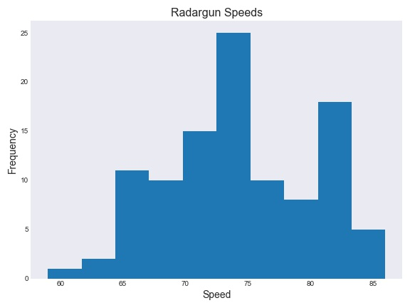
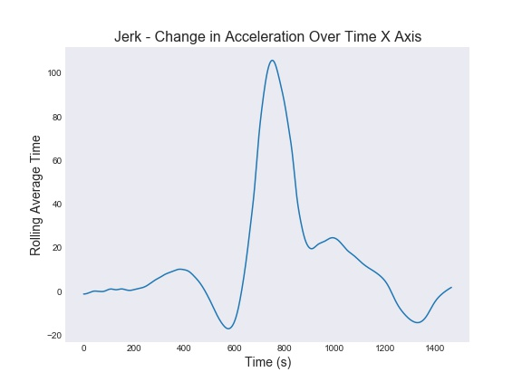
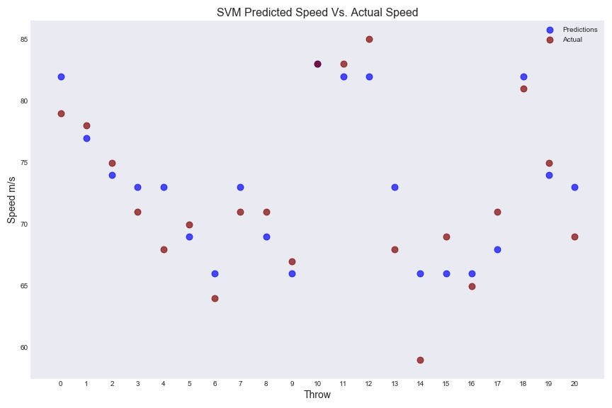

# Table of Contents

- [Table of Contents](#table-of-contents)
  - [Introduction](#introduction)
  - [Goals](#goals)
  - [Data Processing](#data-processing)
    - [Dataset Overview](#dataset-overview)
    - [Processing Steps](#processing-steps)
  - [Results](#results)
  - [Summary](#summary)

## Introduction

Athletes look to science to increase their performance. With the tremendous scientific advancements human-kind achieved, it's easy to overlook the more simplistic tools to achieve similar solutions.
The owner of the dataset, Hikmet Gumus, captured the accelerations generated by four experienced handball players performing overarm throwings by attaching an Inertial Measurement Unit (IMU) to the players' dominant hand's wrist. The device Hikmet Gumus attached is relatively inexpensive, thus, more easily attainable. Suppose we can predict the ball's velocity using simple measurements; if we examine the data thoroughly, we could likely deduce how to increase the athletes' performance, and to decrease the risk of injury.

## Goals

1. Experience working with sensory data.
2. Predict the balls' velocity using wrist acceleration measurements captured by the IMU.

## Data Processing

To my understanding, IMU's do not typically return acceleration in meters by seconds squared (acceleration) or in radians (angular velocity); thus, this dataset is great for introductory reasons. On the other hand, I was hoping the owner had shared the unconverted raw data and the IMU's manual to convert the readings by myself to the correct units.
Since the owner already transformed the raw data, I assume they also calibrated the devices and that the readings are accurate.

### Dataset Overview

The owner published 106 files containing information.

The file 'Speed-Filenames.csv' contains 105 rows and two columns; radar gun speed and the file name with the IMU measurements.

According to the Shapiro-Wilk normality test, the measured speeds follow a normal distribution. Failed to reject the null hypothesis with 95% confidence.

 
*Fig 1. Measured radar gun velocities hisogram. Statistic=0.976, p_value=0.053, alpha=0.05.*

The other 105 files contain varying amounts of rows depending on how long it took the athlete to complete the throw and seven columns; time, acceleration on x, y, z axes, and angular velocity on the x, y, z axes.

 *Fig 2. Scatter plot showing the acceleartion vector on the X, Y, Z axes on one of raw-data files.*

The original raw data contained some noise. In this instance, noise is the term for measurement errors obtained by the sensor.

 *Fig 3. Change in acceleration over time (Jerk)*

For example, in Fig. 3, we can see the change in acceleration over time on the X-axis. However, this change is not smooth. The acceleration shows small oscillations, which typically inhibits the modeling training.
Consequently, I applied the rolling average with a 151 frame window size for every point along the axes' trajectory.

*Fig 4. Post filtering change in acceleration over time*

Although it's not perfect, it filters most of the noise.

Additionally, to increase the model's ability to learn, I capture readings around the peak acceleration on the x-axis.  I assume the players would try to throw the ball when their wrists are at peak momentum. Therefore, at every throw, I find the maximum acceleration and capture 100 frames before and after.

*Fig 5. Post filtering change in acceleration over time around the throw's maximum acceleration.*

### Processing Steps

- Rename columns
- Focus on acceleration and ignore the angular velocity (for now)
- Intergrate acceleration to calculate the velocities
- Smoothen the values to help reduce noise
- Calculate the vector magnitude (acceleration and velocity)
- Focusing on readings near the acceleration peak
- Scale the data
- Create a training and testing datasets
  - Each row would contain the acceleration magnitudes for a single throw (file)
  - Append the radar gun reading to the observations
  - Optional: Add wrist velocities

_I recommend jumping straight to the final_notebook. I maintained the other notebooks as an archive and testing grounds for new functions_

## Results

The best model achieves an RMSE of 2.89 meters per second on the test set. Whereas some of the predictions are highly accurate, some are vastly over or under-estimated. I suspect that by training the model only on the accelerations, I may have constrained the model's ability to estimate the final velocity in some cases.

## Summary

I applied a supervised learning algorithm, Support Vector Machine (SVM), to predict the final velocity of a ball thrown by a professional handball player.

Before modeling, I calculated the wrist's velocity at every time frame by integrating the acceleration. Then, I smoothed the data by calculating the rolling average with a window size of 151 frames. Followed the smoothing, I calculated the magnitude of both vectors (acceleration and velocity). Lastly, I captured only 100 frames before and after the maximum acceleration vector for both the acceleration and velocity vectors (a total of 402 features per throw).

I randomly selected 84 out of the 105 observations (80%) to train the model and evaluated the model's performance on the remaining 21 observations (20%). The model achieved an RMSE of 2.89 m/s, providing quality predictions, for the most part.

 *Fig 6. Scatter plot comparing the speed predictions made by the SVM model against the actual speeds records by the radar gun.*
